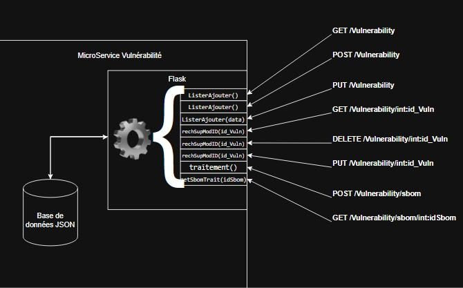

# Vulnerability MicroService

# SAE401 - DevCloud - Document de Conception MicroService Vulnerability


## Gestion des vulnérabilités
**Responsable : Killian CHESNOT**

| API REST | Méthode | Description | Code |
|----------|---------|-------------|-------------|
| **GET /Vulnerability** | `ListerAjouter()` | Affiche toutes les vulnérabilité | **200** : Succès <br> **500** : Erreur lors de la lecture du fichier JSON |
| **POST /Vulnerability** | `ListerAjouter()` | Ajouter un ou plusieurs Vulnérabilités | **200** : Ajout Réussi <br> **400** : Données invalides ou champs manquants <br> **422** : L'ID existe déjà |
| **PUT /Vulnerability** | `ListerAjouter(data)` | Modification d'une Vulnérabilité en récupérant automatiquement son ID|**200** : Mise à jour réussie. <br> **500** : Erreur de lecture de la base de données <br> **404** :  Aucune vulnérabilité avec cet ID |
| **GET /Vulnerability/int:id_Vuln** | `rechSupModID(id_Vuln)` | Récupère les données d’une vulnérabilité par ID | **200** : Retourne la vulnérabilité correspondante <br> **404** : Aucune vulnérabilité avec cet ID <br> **500**: Erreur de lecture de la base de données| 
| **DELETE /Vulnerability/int:id_Vuln** | `rechSupModID(id_Vuln)` | Supprime les données d’une vulnérabilité par ID | **200** : Suppression réussie <br> **500** : Vulnérabilité non supprimé |
| **PUT /Vulnerability/int:id_Vuln** | `rechSupModID(id_Vuln)` | Modifie les données d’une vulnérabilité par son ID | **200** : Mise à jour réussie <br> **404** :  Aucune vulnérabilité avec cet ID <br> **500**: Erreur de lecture de la base de données |
| **POST /Vulnerability/sbom** | `traitement()` | Récupère le Nom du Package et sa version, cela retourne les vulnérabilités associés | **200** :Retourne les vulnérabilités correspondant au SBOM <br> **404** :  Aucune vulnérabilité correspondante trouvée <br> **400** : Clés manquantes dans l'entrée JSON |
| **GET /Vulnerability/sbom/int:idSbom** | `getSbomTrait(idSbom)` | Reçois un ID SBOM et effectue une requête vers le Microservice SBOM pour retourner les vulnérabilités associés | **200** :Retourne les vulnérabilités associées au SBOM <br> **404** :  Aucune vulnérabilité correspondante trouvée <br> **400** : Clés manquantes dans les données récupérées <br> **500**: Erreur de lecture de la base de données <br> **420**: Erreur de liaison du microservice |
---
## Voici l'organisation de la base de données.

### **Vulnerability.json**  
```json
{
    "id": 1,
    "VulnerabilityID": "CVE-2023-23397",
    "PkgName": "microsoft-outlook",
    "InstalledVersion": "16.0.15330.20298",
    "FixedVersion": "16.0.16130.20306",
    "Severity": "CRITICAL",
    "Title": "Microsoft Outlook - NTLM Relay Attack (CVE-2023-23397)",
    "Description": "A vulnerability in Microsoft Outlook allows remote attackers to perform NTLM relay attacks by sending specially crafted emails, leading to privilege escalation.",
    "References": "https://nvd.nist.gov/vuln/detail/CVE-2023-23397"
}
```

---

### **Cette API permet notamment :**  
- L'ajout de vulnérabilités, plusieurs à la fois.  
- La suppression de vulnérabilités par leur ID.  
- La liste de toutes les vulnérabilités ou d'une seule grâce à son ID.  
- La modification d'une vulnérabilité avec la possibilité de préciser ou non l'ID.  

---

### **Interaction avec deux autres microservices**  
L'API interagit avec deux autres microservices à l'aide de deux méthodes :  

1. **Récupération des vulnérabilités associées à un SBOM**  
   - Le SBOM peut contenir un ou plusieurs packages (nom, version).  
2. **Consultation du microservice `consult-sbom` pour récupérer les vulnérabilités associées.**  


---



## Contributors

- FI

## License

This project is licensed under the MIT License - see the [LICENSE](LICENSE) file for more details.
