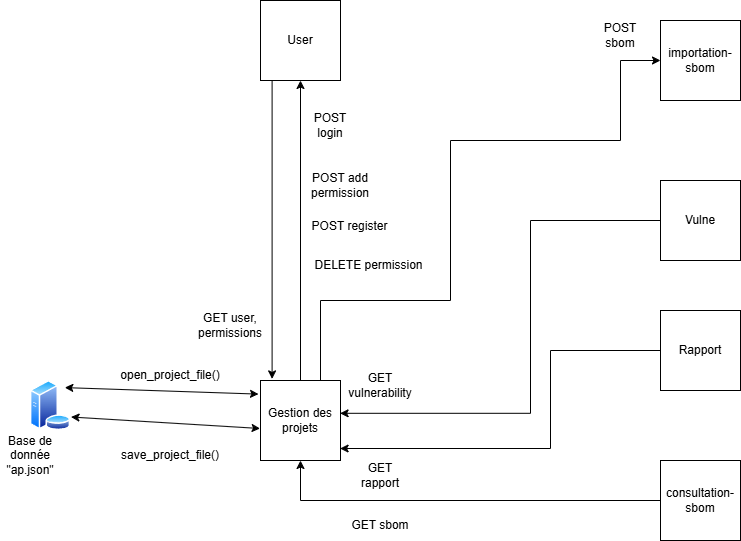
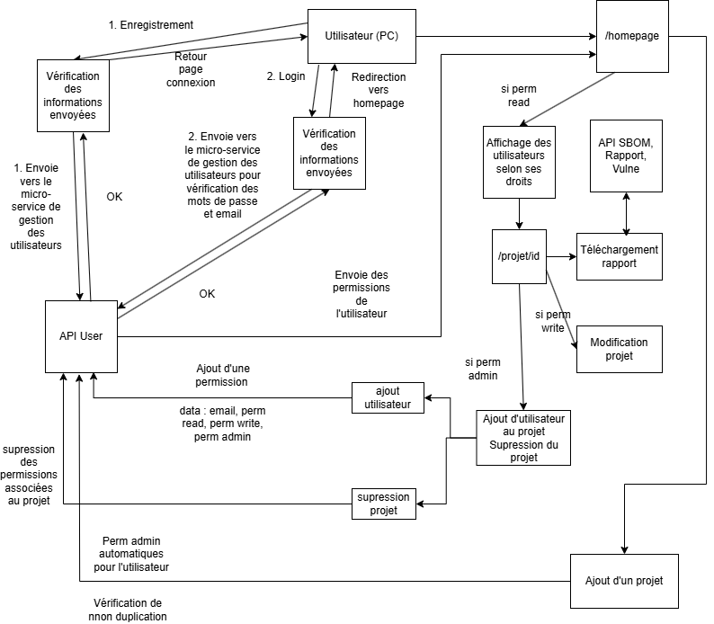

# Présentation générale du microservice

Ce micro-service à pour but de rassembler toutes les fonctionnalités des autres micro-services afin de les rendre exploitables de manière ergonomique. Il aura donc deux rôles principaux : 
 
 -**Communiquer** avec les autres micro-services afin de recevoir ou d'envoyer des données
 
 -**Afficher** les données reçus par ces dernière pour que l'utilisateur aie une expèrience agréable
 
 
# Fichiers composant le micro-service

Ce micro service est donc constitué des fichiers : 

- **README** : contient les informations du micro service, un diagramme d'utilisateur ainsi qu'un diagramme de fonctionnement
- **DockerFile** : Ce fichier sert à construire une image du conteneur hébergeant notre site
- **Contrat d'interface** : Ce fichier affichera toutes les fonctions étant acessibles grâce à des requêtes HTTP
- **Code python** : Ce fichier constitue la majeur partie du microservice. Il constitue la partie fonctionnelle de l'application
- **Template** : Utilisées par le code python afin de créer des sites dynamiques

# Diagrammes de fonctionnement

Voici maintenant le diagramme de communication de notre micro-service avec les autres microservices : 

.

Nous pouvons constater une très grande dépendance de notre service envers les autres. Le défis sera donc de rendre ce service utilisable même quand un micro-service ne fonctionne pas. Intéressons nous ensuite au système d'utilisateur. En effet, c'est la partie la plus complexe du projet :

.


# DockerFile

Le fichier DockerFile sert dans un premier temps à construire l'image Docker de notre micro-service. Dans un second temps, celui-ci sera utilisé dans le DockerCompose afin de créer et démarrer automatiquement tous les services. Voici donc la composition de notre Docker File : 
```
FROM python:3.11
WORKDIR /app
COPY requirements.txt ./
RUN pip install --no-cache-dir -r requirements.txt
COPY . .
ENV FLASK_APP=app.py
ENV FLASK_RUN_HOST=0.0.0.0
EXPOSE 5000
CMD ["flask", "run"]
```

L'image que nous utilisons est donc une image python 3.11. Nous creeons ensuite un dossier **app** et nous nous plaçons dedans afin de pouvoir importer des fichiers sans risque de perturber le fonctionnement de l'image en elle même. Nous copions le fichier **requierement.txt**. Celui-ci contiens tous les modules indispensables à installer pour le bon fonctionnement de notre microservice. Les voici : 

- Flask version 3.1
- requests version 2.32

Nous installons ensuite automatiquement les modules. Cela a pour avantage d'avoir une uniformité d'image et que côté utilisateur, cela soit totalement transparent.

Une fois l'installation achevée, nous copions le dossier contenant tous les fichiers (appli python et template principalement). Nous modifions ensuite les variables d'environnement afin que le conteneur sache quel fichier sera utilisé comme application FLASK et lui ordonner d'écouter sur toutes les adresses IP. Nous ouvrons ensuite le port 5000 afin que l'appli soit joignable de l'extèrieur. Cette dernière action n'est pas obligatoire mais vise à améliorer la transparence du code.

Lors de la création du conteneur, nous exécutons un flask run pour démarrer le service/

# Contrat d'interface
Le contrat d'interface se trouve dans le fichier **openapi.yaml**. Celui-ci contient les différentes informations sur notre micro-service. 

Ce contrat peut être découpé en trois sous catégories : 

## Gestion des utilisateurs

Cette partie est identifiée par le tag **"user"**. Elle est composée de 5 méthodes distinctes identifiées par les routes suivantes : 

- "/" : Méthode GET : Retourne la page d'authentification à l'API

- "/login/login" : Méthode POST : Envoie les informations de connexion afin que l'utilisateur puisse répondre de son identité et ainsi utiliser l'API selon les droits lui étant attribués.


- "/register" : Méthode GET :  Retourne la page HTML d'enregistrement d'un nouvel utilisateur
 


- "/register/send" : Méthode POST : Envoie les informations du nouvel utilisateur à la base de donnée utilisateur afin que celui-ci vérifie celles-ci et l'inscrive


- "/logout" : Méthode GET : Permet la déconnexion d'un utilisateur 

  

## Gestion des projets

Cette partie est identifiée par le tag **"projets"**. La plupart de ces méthodes sont directement en contact avec d'autres micro-sercices telles que les microservices **Utilisateurs** ou **Importation-SBOM**.

- "/homepage" : Méthode GET : Retourne la page d'acceuil possédant la liste des projets que l'utilisateur a le droit de consulter mais aussi une possibilité d'ajouter des projets.

- "/projet/{id}" : Méthode GET : Retourne la page HTML possédant les détails d'un projet si l'utilisateur connecté à les droits. Cette page contiendra le nom, l'ID, la description, la possibilité de modifier si l'utilisateur à les droits ainsi que d'ajouter des utilisateurs ou de supprimer le projet.

- "/projet/json/{id}" : Méthode GET : Retourne le fichier json associé à un projet

- "/projet/add" : Méthode POST : Permet d'ajouter un projet. L'utilisateur sera automatiquement admin dessus. Il devra aussi lui-même fournir le SBOM associé au projet.

- "/projet/update" : Méthode PUT : Permet de mettre à jour un projet à partir de son ID et des nouvelles informations

- "/projet/delete" : Méthode DELETE : Supprimer un projet grâce à son ID.

- "/projet/projet/adduser" : Méthode POST : Ajoute un utilisateur au projet. Possibilité de lui attribuer des droits spécifiques : lecture, ecriture ou admin.


## Accès aux documents
Cette partie est identifiée par le tag **"doc"** dans le contrat d'interface. Celle-ci retourne dans chaque cas un fichier exploitable et téléchargeable.

- "/rapport/{id}" : Méthode GET : Retourne un fichier PDF contenant le rapport général du projet

- "/sbom/{id}" : Méthode GET : Retourne un fichier JSON contenant le SBOM*

- "/vulne/{id}" : Méthode GET : Retourne un fichier JSON contenant le rapport de vulnérabilité du projet


Ce contrat d'interface est par ailleurs consultable dans la branche. Il précise par ailleurs les différents codes d'erreurs des API. 


# Code python

## Liste des modules

Voici la liste de toutes les bibliothèques utilisées par notre micro-service : 

- Flask : Module Web Python :

    - Flask : Utilisé pour configurer l'application en elle même
    - request : Utilisé afin de récupérer les informations données en POST
    - render_template : Utilisé afin de retourner des pages HTML dynamiques. Aussi très utile pour l'utilisation de Jinja
    - redirect : Utilisé pour faire passer un utilisateur sur une URL précise
    - send_file : Utilisé pour envoyer des fichiers aux autres micro-services et aux utilisateurs
    
- JSON : Module python pour manipuler des fichiers JSON avec python
- Module requests : Module python pour effectuer des requêtes HTML (POST, GET, etc)

## Liste des méthodes du micro-service : 

| Méthode                  | Fonctionnalité | Paramètres d'entrée | Sortie | Codes de sortie | Dépendances API |
|--------------------------|---------------|----------------------|--------|----------------|------------------------|
| `open_project_file` | Ouvre le fichier JSON des projets et le charge dans un dictionnaire. | Aucun | Dictionnaire des projets ou message d'erreur | `200`, `415` | Aucune |
| `save_project_file(dico)` | Sauvegarde les projets dans le fichier JSON. | `dico` (dictionnaire des projets) | Message de succès ou d'erreur | `200`, `404`, `415` | Aucune |
| `bienvenue()` | Affiche la page d'accueil avec les projets accessibles par l'utilisateur. | Aucun | Page HTML `index.html` ou redirection | `200`, `403` | Aucune |
| `login()` | Affiche la page de connexion. | Aucun | Page HTML `login.html` | `200` | Aucune |
| `checklogin()` | Vérifie les identifiants et récupère les permissions utilisateur. | `mail`, `password` via POST | Redirection vers `/homepage` ou `/` | `302`, `403` | `http://user:5000/login`, `http://user:5000/user/{mail}`, `http://user:5000/permissions-by-email/{mail}` |
| `get_project(id)` | Affiche les détails d'un projet si l'utilisateur a les droits de lecture. | `id` (ID du projet) | Page HTML `detail.html` ou message d'erreur | `200`, `404` | Aucune |
| `get_json(id)` | Récupère les informations d’un projet sous format JSON. | `id` (ID du projet) | Données JSON du projet ou message d'erreur | `200`, `404` | Aucune |
| `add_project()` | Ajoute un nouveau projet avec un fichier JSON et une description. | `name`, `json` (fichier), `description` | Redirection vers `/homepage` ou message d'erreur | `302`, `403`, `415`, `511`, `512`, `513` | `http://user:5000/add-permissions`, `http://import-sbom:5000/sbom` |
| `update_project()` | Met à jour un projet si l'utilisateur a les droits d'écriture. | `id`, `name`, `description` via POST | Redirection vers `/homepage` ou message d'erreur | `302`, `403`, `404`, `513` | Aucune |
| `remove_project(id)` | Supprime un projet si l'utilisateur a les droits d'administration. | `id` (ID du projet) | Redirection vers `/homepage` ou message d'erreur | `302`, `403`, `513` | `http://user:5000/permissions-by-project/{id}`, `http://user:5000/delete-permissions?project_id={id}&email={email}` |
| `ajouter_user()` | Ajoute un utilisateur à un projet avec des permissions spécifiques. | `email`, `id` (ID projet), `permissions` | Redirection vers la page du projet ou erreur | `302`, `511` | `http://user:5000/add-permissions` |
| `get_rapport(id)` | Télécharge un rapport PDF d'un projet. | `id` (ID du projet) | Fichier PDF ou message d'erreur | `200`, `404` | `http://rapport:5000/pdf/{id}` |
| `get_sbom(id)` | Télécharge le fichier SBOM JSON d'un projet. | `id` (ID du projet) | Fichier JSON ou message d'erreur | `200`, `404` | `http://consult-sbom:5000/sbom/{id}` |
| `get_vulne(id)` | Télécharge les vulnérabilités d'un projet sous format JSON. | `id` (ID du projet) | Fichier JSON ou message d'erreur | `200`, `404` | `http://vuln:5000/Vulnerability/sbom/{id}` |
| `enre()` | Affiche la page d'inscription. | Aucun | Page HTML `register.html` | `200` | Aucune |
| `send_user()` | Enregistre un nouvel utilisateur. | Données du formulaire d'inscription | Redirection vers `/` ou message d'erreur | `302`, `513` | `http://user:5000/register` |
| `logout()` | Déconnecte l'utilisateur en supprimant ses données globales. | Aucun | Redirection vers `/` | `302` | Aucune |

Nous constatons que l'ID est toujours utilisé afin de laisser notre micro-service le plus léger possible

# Template

Afin d'utiliser Flask mais surtout Jinja de manière optimale, nous utilisons des template HTML. Ces Templates sont des fichiers HTML dont les données sont modifiées dynamiquement grâce aux données envoyées par le code Flask. Nous utilisons 4 Templates différentes : 
- **login.html** : Cette page est la page d'acceuil par défaut. Elle sert à la connexion des utilisateurs mais aussi à l'enregistrement de nouveaux utilisateurs. 

- **index.html** : Cette page est la page qui est retournée à l'utilisateur après sa connexion. Elle affiche de manière dynamiques tous les projets qu'il a le droit de lire. Cette page fait office de hub ou il peut se déconnecter  

- **details.html** : Cette page affiche les détails d'un projet quand l'utilisateur a les permissions de le faire (permissions read)

- **register.html** : Page servant à l'enregistrement d'un nouveal utilisateur;


# Base de donnée

La base de donnée utilisateur est composée de d'un JSON de JSON possédant les particularités suivantes  :

```
{
    "id":{
        "id":str,
        "description":str,
        "nom":str
    }
}
```
Cela a pour avantage que l'API est relativement légère : toutes les autres données sont stockées dans les autres micro-services. La communication entre les différents autres services se feront grâce à l'ID du projet.


# Améliorations possibles
 
Liste visible des utilisateurs

MAJ SBOM

Possibilité de modifier les utilisateurs

Interface utilisateur

Optimisation de la gestion des fichiers

Optimisation de la suppression des permissions


